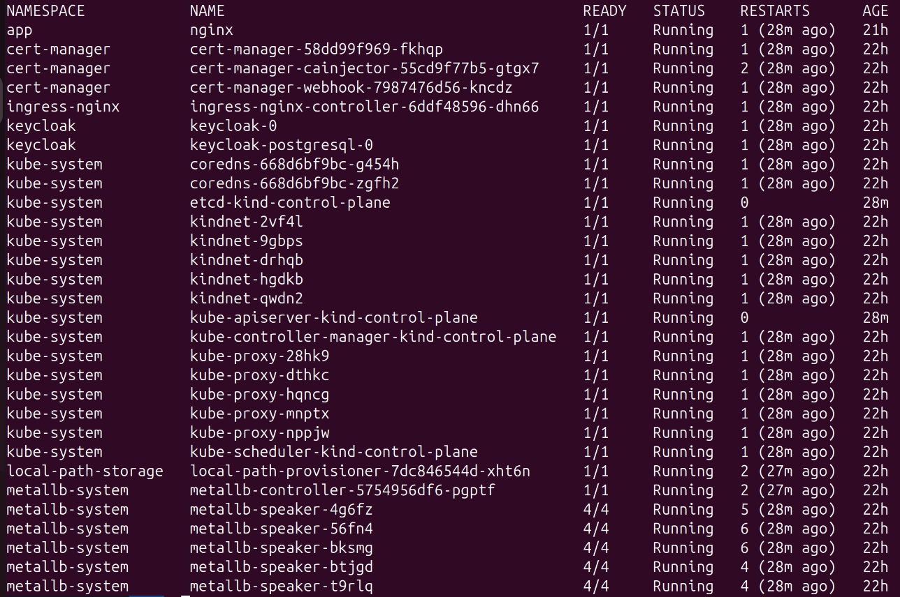
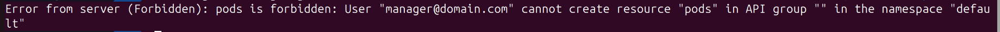
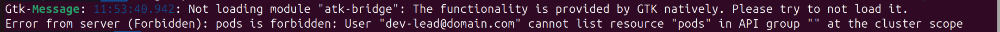
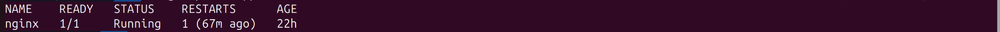
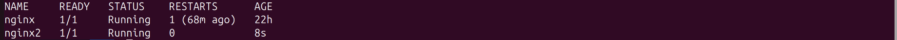
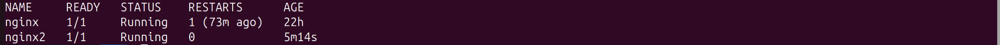
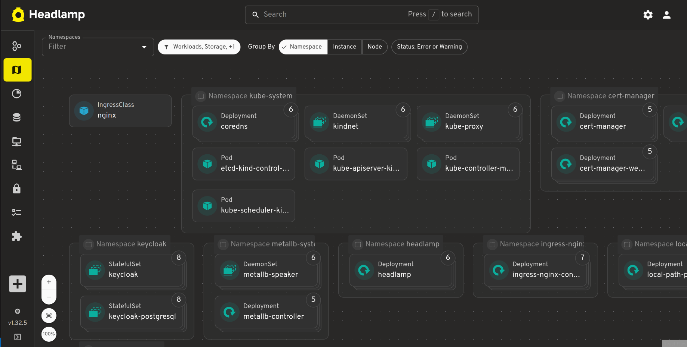

# Use Keycloak as OIDC Provider to Grant Access to Kubernetes Cluster with kube-oidc Plugin and Headlamp UI

## Requirements

- [Docker](https://docs.docker.com/engine/install/)
- [kubectl](https://kubernetes.io/docs/tasks/tools/)
- [kind CLI](https://kind.sigs.k8s.io/docs/user/quick-start/#installation)
- [Helm](https://helm.sh/docs/intro/install/)
- [Terraform](https://developer.hashicorp.com/terraform/tutorials/aws-get-started/install-cli)
- [kube-oidc plugin (kubelogin)](https://github.com/int128/kubelogin)

## Setup Kubernetes Cluster

Run `./cluster-setup.sh` to create a Kubernetes cluster with:

- 1 control-plane node
- 4 worker nodes
- Installed ingress-nginx
- Installed MetalLB
- 4 proxy image repositories in Docker containers within one network

## Deploy cert-manager and add generated TLS key pair as CA

Run `./cert-manager-setup.sh`

## Deploy Keycloak and Setup RBAC Access

Run `./keycloak-setup.sh`

This will create 3 groups with 4 users having specific RBAC permissions:

| Group           | User     | Cluster Permission              |
|-----------------|----------|---------------------------------|
| kube-dev        | dev1     | view role on namespace `app`    |
| kube-dev        | dev2     | view role on namespace `app`    |
| kube-dev-lead   | dev-lead | edit role on namespace `app`    |
| kube-manager    | manager  | view role on cluster            |
| kube-admin      | admin1   | admin role on cluster           |

## Configure Keycloak

Run: `terraform init && terraform apply -auto-approve`

## Install Headlamp UI

Run: `./headlamp-setup.sh`

## Configure kubectl (Install kube-oidc Plugin First)

Run `./kubectl-oidc.sh`

This will set the current context to `oidc-client` on the `kind-kind` cluster.

## Testing

### User: manager

1. Run `kubectl get po -A`

2. In the opened browser, enter credentials:
   - Username: `manager`
   - Password: `manager`

   

3. Attempt to create a pod (should be forbidden):

   

### User: dev-lead

1. Clean previous session: `kubectl oidc-login clean`
Don't forget to logout from Keycloak.

2. Enter credentials:

   - Username: `dev-lead`
   - Password: `dev-lead`

3. Run `kubectl get po -A`:

    

    `dev-lead` doesn't have permission to list pods in all namespaces.

4. List pods in `app` namespace: kubectl get po -n app
    

5. Create a new pod in `app` namespace: `kubectl run nginx2 --image nginx -n app`

    

    `dev-lead` has permission to run pods as expected.

### User: dev1

1. Clean previous session: `kubectl oidc-login clean`

    Don't forget to logout from Keycloak.

2. Enter credentials:

   - Username: `dev1`
   - Password: `dev1`

3. List pods in `app` namespace: `kubectl get po -n app`
    

    User can list pods in namespace `app`.

4. Attempt to create a pod in `app` namespace (should be forbidden):

    

User can't create pods in namespace `app` as expected.

## Testing Headlamp UI

1. Go to `https://console.kind.cluster`
    Don't forget to logout from Keycloak.

2. Enter credentials:

   - Username: `admin1`
   - Password: `admin1`

3. Got access to cluster as cluster admin

